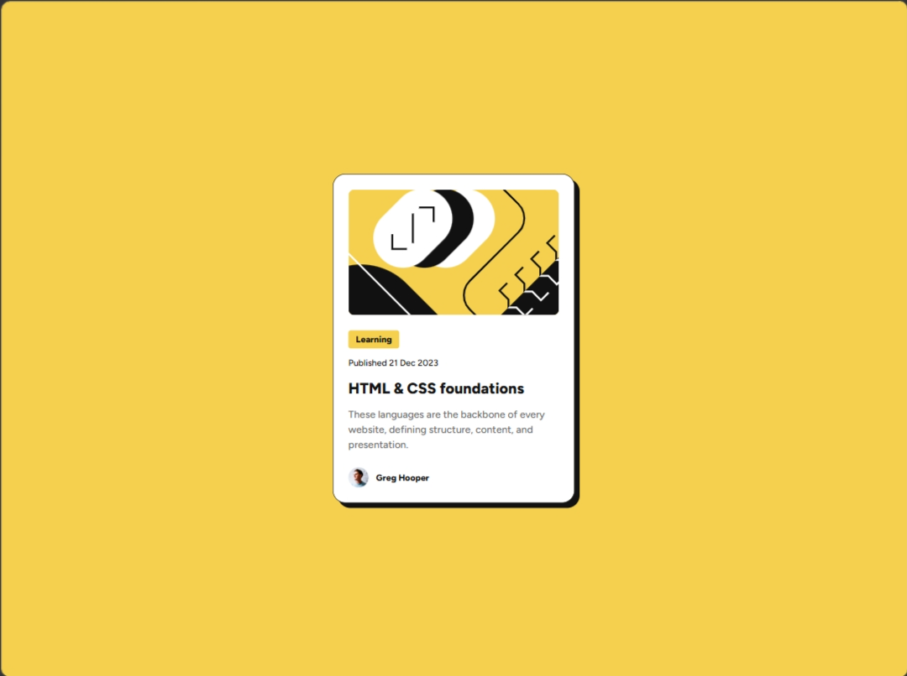

# Frontend Mentor - Blog preview card solution

This is my solution to the [Blog preview card challenge on Frontend Mentor](https://www.frontendmentor.io/challenges/blog-preview-card-ckPaj01IcS). I built this project to practice semantic HTML, CSS layout, responsive sizing, and interactive states.

## Table of contents

- [Frontend Mentor - Blog preview card solution](#frontend-mentor---blog-preview-card-solution)
  - [Table of contents](#table-of-contents)
  - [Overview](#overview)
    - [The challenge](#the-challenge)
    - [Screenshot](#screenshot)
    - [Links](#links)
  - [My process](#my-process)
    - [Built with](#built-with)
    - [What I learned](#what-i-learned)
    - [Continued development](#continued-development)
    - [AI collaboration](#ai-collaboration)
  - [Author](#author)

## Overview

### The challenge

Users should be able to:

- View the blog preview card across different screen sizes
- See hover and keyboard focus states on the article title

### Screenshot

### Links

- Solution URL: Add after submitting to Frontend Mentor
- Live Site URL: Add after deploying the project

## My process

### Built with

- Semantic HTML5 markup
- CSS custom font loading with `@font-face`
- Flexbox
- Responsive sizing with relative widths and `max-width`
- Mobile-friendly layout

### What I learned

In this project, I learned how to choose semantic elements such as `main`, `article`, and `time` instead of using generic containers for everything. I also practiced loading a local variable font with `@font-face`.

I used Flexbox to center the card on the page, arrange its content vertically, and align the author image with the author's name. I learned that `gap` works only after an element becomes a flex or grid container.

I also practiced making a card responsive by combining `width: 100%`, `max-width`, page padding, and a responsive image. Finally, I added hover and keyboard focus states to make the article link interactive and accessible.

### Continued development

I want to continue improving my understanding of responsive layouts, semantic HTML, accessible focus states, and how spacing properties such as padding, margin, and gap work together.

### AI collaboration

I used Codex as a learning assistant during this project. It reviewed my HTML and CSS, explained semantic elements and Flexbox concepts, and gave progressive hints when I encountered layout problems. I wrote and tested the implementation myself instead of copying a complete solution.

## Author

- Frontend Mentor: Add your Frontend Mentor profile URL
