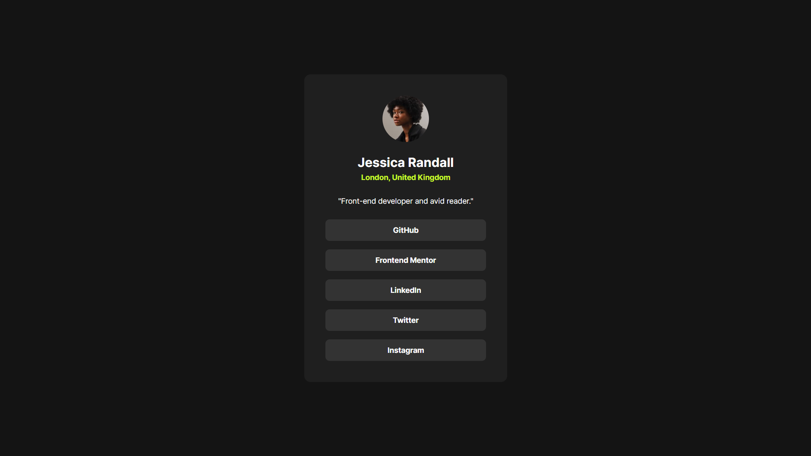

# Frontend Mentor - Social links profile solution

This is my solution to the [Social links profile challenge on Frontend Mentor](https://www.frontendmentor.io/challenges/social-links-profile-UG32l9m6dQ).

The challenge was to build a responsive profile card that presents Jessica Randall's profile information and social media links. I focused on matching the provided design while practicing semantic HTML, Flexbox, responsive CSS, local font loading, and accessible interactive states.

## Overview

### The challenge

Users should be able to:

- View the profile card at different screen sizes
- See hover states for all social links
- See clear keyboard focus states when navigating with the Tab key

### Screenshot

Add your project screenshot as `screenshot.jpg` in the project root. The image below will display it in this README:

### Links

- Solution URL: Add your Frontend Mentor solution URL after submitting
- Live Site URL: (https://crebpakorn.github.io/challenges/social-links-profile-main/index.html)

## My process

### Built with

- Semantic HTML5 markup
- CSS Flexbox
- Responsive sizing with `width`, `max-width`, and media queries
- Local variable font loaded with `@font-face`
- CSS pseudo-classes for hover and keyboard focus states

### What I learned

This project helped me understand how to separate layout responsibilities between elements. The `main` element centers the card on the page, while the card itself controls its background, padding, and content spacing.

I practiced using Flexbox to stack the profile content vertically and to make the social links equal in width. I also learned how `gap` works between flex items and why default margins on headings and paragraphs can affect spacing.

I loaded the local Inter variable font with `@font-face` and used the font weights from the style guide. I also added `:hover` and `:focus-visible` states so the links provide feedback for both mouse and keyboard users.

### Continued development

In future projects, I want to continue improving my ability to:

- Compare spacing and typography accurately with a reference design
- Choose responsive breakpoints based on content rather than one device size
- Create stronger keyboard focus styles
- Organize CSS into separate files as projects become larger

### Useful resources

- [MDN: CSS Flexbox](https://developer.mozilla.org/en-US/docs/Web/CSS/CSS_flexible_box_layout) - Helped me understand how to arrange and align the card content.
- [MDN: Using media queries](https://developer.mozilla.org/en-US/docs/Web/CSS/CSS_media_queries/Using_media_queries) - Helped me make the card adapt to smaller screens.
- [MDN: `:focus-visible`](https://developer.mozilla.org/en-US/docs/Web/CSS/:focus-visible) - Helped me create a visible keyboard focus state for the links.

### AI collaboration

I used Codex as a learning assistant during this project. It reviewed my HTML and CSS, explained semantic elements, Flexbox, spacing, responsive layouts, and accessibility, and gave progressive hints when I was stuck. I wrote and tested the implementation myself instead of copying a complete solution.

## Author

- Frontend Mentor: Add your Frontend Mentor profile URL

## Acknowledgments

Thanks to [Frontend Mentor](https://www.frontendmentor.io) for providing the challenge and design resources.
